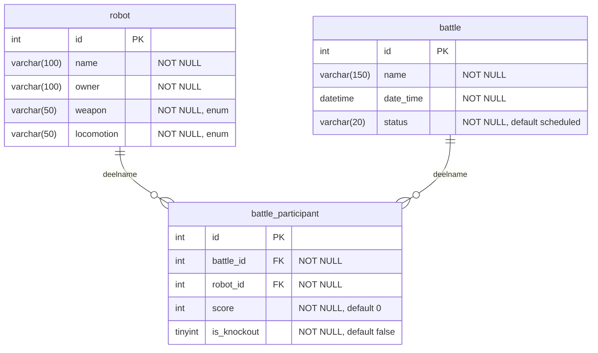

# BrawlBots Scoreboard - Verantwoording

Je kan de diagrammen bekijken met een plugin voor **mermaid** of via de [Mermaid website](https://mermaid.ai/).

## Klassediagram

```mermaid
classDiagram
    direction LR

    class Robot {
        -int id
        -string name
        -string owner
        -Weapon weapon
        -Locomotion locomotion
        -Collection~BattleParticipant~ battleParticipants
        +getId() int
        +getName() string
        +setName(string name) static
        +getOwner() string
        +setOwner(string owner) static
        +getWeapon() Weapon
        +setWeapon(Weapon weapon) static
        +getLocomotion() Locomotion
        +setLocomotion(Locomotion locomotion) static
        +getBattleParticipants() Collection
        +addBattleParticipant(BattleParticipant p) static
        +removeBattleParticipant(BattleParticipant p) static
        +__toString() string
    }

    class Battle {
        -int id
        -string name
        -DateTimeInterface dateTime
        -BattleStatus status
        -Collection~BattleParticipant~ participants
        +getId() int
        +getName() string
        +setName(string name) static
        +getDateTime() DateTimeInterface
        +setDateTime(DateTimeInterface dt) static
        +getStatus() BattleStatus
        +setStatus(BattleStatus status) static
        +isCompleted() bool
        +getParticipants() Collection
        +addParticipant(BattleParticipant p) static
        +removeParticipant(BattleParticipant p) static
        +__toString() string
    }

    class BattleParticipant {
        -int id
        -Battle battle
        -Robot robot
        -int score
        -bool isKnockout
        +getId() int
        +getBattle() Battle
        +setBattle(Battle battle) static
        +getRobot() Robot
        +setRobot(Robot robot) static
        +getScore() int
        +setScore(int score) static
        +isKnockout() bool
        +setIsKnockout(bool ko) static
    }

    class Weapon {
        <<enumeration>>
        SawBlade
        Hammer
        Flipper
        Spinner
        Crusher
        Flamethrower
        Axe
        Wedge
        +label() string
    }

    class Locomotion {
        <<enumeration>>
        Wheels
        Tracks
        Legs
        Hover
        Shuffle
        +label() string
    }

    class BattleStatus {
        <<enumeration>>
        Scheduled
        Completed
        +label() string
    }

    class BattleScoreInput {
        <<DTO Input>>
        +int winner
        +bool isKnockout
    }

    class BattleAddRobotInput {
        <<DTO Input>>
        +Robot robot
    }

    class RobotStatistics {
        <<DTO Output>>
        +int wins
        +int losses
        +int knockouts
        +int battles_fought
        +int total_score
    }

    class LeaderboardEntry {
        <<DTO Output>>
        +Robot robot
        +int wins
        +int losses
        +int knockouts
        +int total_score
    }

    class RobotRepository {
        <<Repository>>
        +findAllOrderedByName() Robot[]
        +getStatistics(Robot robot) RobotStatistics
        +getLeaderboard() LeaderboardEntry[]
        +save(Robot robot, bool flush) void
        +remove(Robot robot, bool flush) void
    }

    class BattleRepository {
        <<Repository>>
        +findAllWithParticipants() Battle[]
        +findOneWithParticipants(int id) Battle
        +findScheduled(int limit) Battle[]
        +findCompleted(int limit) Battle[]
        +save(Battle battle, bool flush) void
        +remove(Battle battle, bool flush) void
    }

    class BattleParticipantRepository {
        <<Repository>>
        +save(BattleParticipant p, bool flush) void
        +remove(BattleParticipant p, bool flush) void
    }

    class RobotType {
        <<Form>>
        +buildForm(FormBuilderInterface, array) void
        +configureOptions(OptionsResolver) void
    }

    class BattleType {
        <<Form>>
        +buildForm(FormBuilderInterface, array) void
        +configureOptions(OptionsResolver) void
    }

    class BattleAddRobotType {
        <<Form>>
        +buildForm(FormBuilderInterface, array) void
        +configureOptions(OptionsResolver) void
    }

    class BattleScoreType {
        <<Form>>
        +buildForm(FormBuilderInterface, array) void
        +configureOptions(OptionsResolver) void
    }

    class HomeController {
        <<Controller>>
        +index(RobotRepository, BattleRepository) Response
    }

    class RobotController {
        <<Controller>>
        +index(RobotRepository) Response
        +new(Request, EntityManagerInterface) Response
        +show(Robot, RobotRepository) Response
        +edit(Request, Robot, EntityManagerInterface) Response
        +delete(Request, Robot, EntityManagerInterface) Response
    }

    class BattleController {
        <<Controller>>
        +index(BattleRepository) Response
        +new(Request, EntityManagerInterface) Response
        +show(int, BattleRepository, RobotRepository) Response
        +edit(Request, Battle, EntityManagerInterface) Response
        +addRobot(Request, Battle, RobotRepository, EntityManagerInterface) Response
        +removeRobot(Request, Battle, int, EntityManagerInterface) Response
        +score(Request, int, BattleRepository, EntityManagerInterface) Response
        +delete(Request, Battle, EntityManagerInterface) Response
    }

    Robot "1" --> "*" BattleParticipant : battleParticipants
    Battle "1" --> "*" BattleParticipant : participants
    BattleParticipant "*" --> "1" Robot : robot
    BattleParticipant "*" --> "1" Battle : battle
    Robot --> Weapon : weapon
    Robot --> Locomotion : locomotion
    Battle --> BattleStatus : status

    LeaderboardEntry --> Robot : robot
    BattleAddRobotInput --> Robot : robot

    RobotRepository ..> Robot : manages
    RobotRepository ..> RobotStatistics : returns
    RobotRepository ..> LeaderboardEntry : returns
    BattleRepository ..> Battle : manages
    BattleParticipantRepository ..> BattleParticipant : manages

    RobotType ..> Robot : binds to
    BattleType ..> Battle : binds to
    BattleAddRobotType ..> BattleAddRobotInput : binds to
    BattleScoreType ..> BattleScoreInput : binds to

    HomeController ..> RobotRepository : uses
    HomeController ..> BattleRepository : uses
    RobotController ..> RobotRepository : uses
    RobotController ..> RobotType : uses
    BattleController ..> BattleRepository : uses
    BattleController ..> RobotRepository : uses
    BattleController ..> BattleAddRobotType : uses
    BattleController ..> BattleScoreType : uses
    BattleController ..> BattleType : uses
```



## Datamodel (ERD)



## Unit Test

De test `RobotRepositoryTest` valideert de kernlogica van de applicatie: het berekenen van
statistieken en het leaderboard op basis van afgeronde gevechten.

**Uitvoeren:** `docker compose exec php php bin/phpunit`

**Resultaat:** 4 tests, 17 assertions, all passing.

```php
<?php

namespace App\Tests\Repository;

use App\Entity\Battle;
use App\Entity\BattleParticipant;
use App\Entity\Robot;
use App\Enum\BattleStatus;
use App\Enum\Locomotion;
use App\Enum\Weapon;
use App\Repository\RobotRepository;
use Doctrine\ORM\EntityManagerInterface;
use Symfony\Bundle\FrameworkBundle\Test\KernelTestCase;

class RobotRepositoryTest extends KernelTestCase
{
    private EntityManagerInterface $em;
    private RobotRepository $robotRepository;

    protected function setUp(): void
    {
        self::bootKernel();
        $this->em = static::getContainer()->get(EntityManagerInterface::class);
        $this->robotRepository = $this->em->getRepository(Robot::class);

        // Clean tables
        $this->em->getConnection()->executeStatement('DELETE FROM battle_participant');
        $this->em->getConnection()->executeStatement('DELETE FROM battle');
        $this->em->getConnection()->executeStatement('DELETE FROM robot');
    }

    private function createRobot(string $name, string $owner = 'Owner'): Robot
    {
        $robot = new Robot();
        $robot->setName($name);
        $robot->setOwner($owner);
        $robot->setWeapon(Weapon::Hammer);
        $robot->setLocomotion(Locomotion::Wheels);
        $this->em->persist($robot);
        return $robot;
    }

    private function createBattle(string $name, BattleStatus $status = BattleStatus::Completed): Battle
    {
        $battle = new Battle();
        $battle->setName($name);
        $battle->setDateTime(new \DateTime());
        $battle->setStatus($status);
        $this->em->persist($battle);
        return $battle;
    }

    private function addParticipant(Battle $battle, Robot $robot, int $score = 0, bool $knockout = false): BattleParticipant
    {
        $bp = new BattleParticipant();
        $bp->setBattle($battle);
        $bp->setRobot($robot);
        $bp->setScore($score);
        $bp->setIsKnockout($knockout);
        $this->em->persist($bp);
        return $bp;
    }

    /**
     * Test dat wins, losses, knockouts en totaalscore correct berekend worden
     * over meerdere afgeronde gevechten.
     */
    public function testGetStatisticsWithWinsAndLosses(): void
    {
        $robot1 = $this->createRobot('ChampBot');
        $robot2 = $this->createRobot('LoserBot');

        // Battle 1: robot1 wins
        $battle1 = $this->createBattle('Battle 1');
        $this->addParticipant($battle1, $robot1, 3, false);
        $this->addParticipant($battle1, $robot2, 0, false);

        // Battle 2: robot1 wins by knockout
        $battle2 = $this->createBattle('Battle 2');
        $this->addParticipant($battle2, $robot1, 3, true);
        $this->addParticipant($battle2, $robot2, 0, false);

        // Battle 3: robot2 wins
        $battle3 = $this->createBattle('Battle 3');
        $this->addParticipant($battle3, $robot1, 0, false);
        $this->addParticipant($battle3, $robot2, 3, false);

        $this->em->flush();

        $stats = $this->robotRepository->getStatistics($robot1);

        $this->assertSame(2, $stats->wins);
        $this->assertSame(1, $stats->losses);
        $this->assertSame(1, $stats->knockouts);
        $this->assertSame(3, $stats->battles_fought);
        $this->assertSame(6, $stats->total_score);
    }

    /**
     * Test dat gevechten met status "scheduled" niet meetellen in statistieken.
     * Alleen afgeronde gevechten (status "completed") worden meegenomen.
     */
    public function testScheduledBattlesExcludedFromStatistics(): void
    {
        $robot1 = $this->createRobot('TestBot');
        $robot2 = $this->createRobot('OpponentBot');

        // Completed battle: robot1 wins
        $completedBattle = $this->createBattle('Completed Battle', BattleStatus::Completed);
        $this->addParticipant($completedBattle, $robot1, 3, false);
        $this->addParticipant($completedBattle, $robot2, 0, false);

        // Scheduled battle: should NOT be counted
        $scheduledBattle = $this->createBattle('Scheduled Battle', BattleStatus::Scheduled);
        $this->addParticipant($scheduledBattle, $robot1, 0, false);
        $this->addParticipant($scheduledBattle, $robot2, 0, false);

        $this->em->flush();

        $stats = $this->robotRepository->getStatistics($robot1);

        $this->assertSame(1, $stats->wins);
        $this->assertSame(0, $stats->losses);
        $this->assertSame(1, $stats->battles_fought);
    }

    /**
     * Test dat een robot zonder gevechten overal 0 terugkrijgt.
     */
    public function testGetStatisticsWithNoBattles(): void
    {
        $robot = $this->createRobot('LonelyBot');
        $this->em->flush();

        $stats = $this->robotRepository->getStatistics($robot);

        $this->assertSame(0, $stats->wins);
        $this->assertSame(0, $stats->losses);
        $this->assertSame(0, $stats->knockouts);
        $this->assertSame(0, $stats->battles_fought);
        $this->assertSame(0, $stats->total_score);
    }

    /**
     * Test dat het leaderboard correct gesorteerd is op aantal wins (aflopend).
     */
    public function testGetLeaderboardOrder(): void
    {
        $robot1 = $this->createRobot('TopBot');
        $robot2 = $this->createRobot('MidBot');
        $robot3 = $this->createRobot('BotBot');

        // robot1 wins both battles
        $battle1 = $this->createBattle('Battle 1');
        $this->addParticipant($battle1, $robot1, 3, false);
        $this->addParticipant($battle1, $robot2, 0, false);

        $battle2 = $this->createBattle('Battle 2');
        $this->addParticipant($battle2, $robot1, 3, false);
        $this->addParticipant($battle2, $robot3, 0, false);

        // robot2 wins one battle
        $battle3 = $this->createBattle('Battle 3');
        $this->addParticipant($battle3, $robot2, 3, false);
        $this->addParticipant($battle3, $robot3, 0, false);

        $this->em->flush();

        $leaderboard = $this->robotRepository->getLeaderboard();

        $this->assertSame('TopBot', $leaderboard[0]->robot->getName());
        $this->assertSame(2, $leaderboard[0]->wins);
        $this->assertSame('MidBot', $leaderboard[1]->robot->getName());
        $this->assertSame(1, $leaderboard[1]->wins);
    }
}
```
